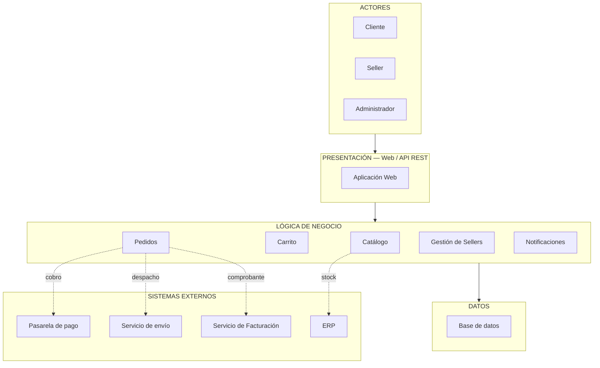

 
## Descripción
 
La capa de **Presentación** expone la aplicación web mediante API REST. La capa de **Lógica de negocio** concentra los módulos de catálogo, carrito, pedidos, gestión de sellers y notificaciones, cada uno con responsabilidades independientes. La capa de **Datos** centraliza la persistencia de toda la información. Los **sistemas externos** (pasarela de pago, servicio de envío, facturación y ERP) se integran únicamente desde los módulos de Pedidos y Catálogo, manteniendo el resto del sistema desacoplado de ellos.