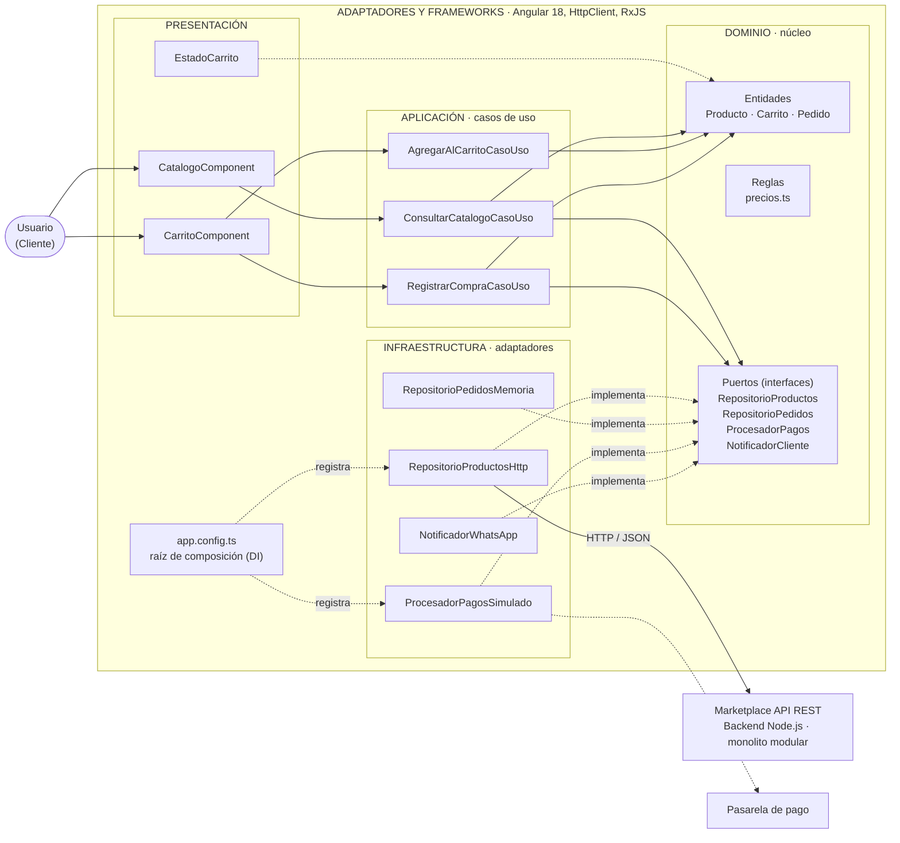
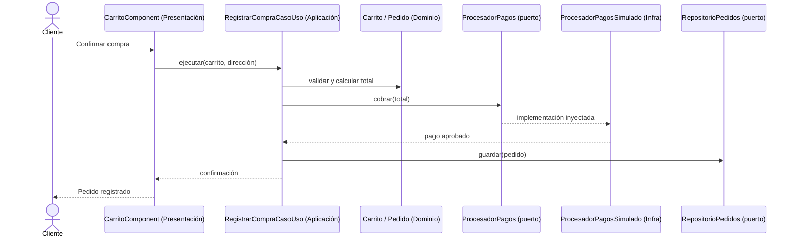

# Enfoque arquitectónico:
 
| Elemento | Descripción aplicada al Marketplace |
|----------|-------------------------------------|
| Patrón / enfoque | Clean Architecture (Arquitectura Limpia) |
| Objetivo | Separar responsabilidades y controlar las dependencias hacia el dominio |
| ¿Qué problema resuelve? | Evita el acoplamiento entre la interfaz Angular, las reglas del negocio y tecnologías externas (BD, APIs, pasarela de pago) |
| Capas definidas | Presentación, Aplicación, Dominio e Infraestructura |
| Beneficios | Mantenimiento y pruebas unitarias más fáciles; cambio de tecnología sin tocar reglas; código mejor organizado |
| Drivers | DA06 (principal), DA04, DA07 |
 
## Regla de dependencia
> Las dependencias del código solo apuntan **hacia adentro**: Infraestructura / Presentación → Aplicación → Dominio. El dominio no importa nada de afuera.
 
## Capas y responsabilidades
| Carpeta | Capa | Contiene | Ejemplo Marketplace |
|---------|------|----------|---------------------|
| `dominio/` | Domain | Entidades, objetos de valor, reglas de negocio | `Producto`, `Carrito`, `Pedido`, `precios.ts` (IGV 18 %) |
| `aplicacion/` | Application | Casos de uso, puertos (interfaces de repositorio y servicios), DTO | `ConsultarCatalogoCasoUso`, `AgregarAlCarritoCasoUso`, `RegistrarCompraCasoUso`; puertos `RepositorioProductos`, `RepositorioPedidos`, `ProcesadorPagos`, `NotificadorCliente` |
| `presentacion/` | Presentación / adaptadores de interfaz | Pantallas, componentes, controladores | `CatalogoComponent`, `CarritoComponent`, `EstadoCarrito`, `AppComponent` |
| `infraestructura/` | Frameworks y drivers | Implementaciones concretas de los puertos | `RepositorioProductosHttp`, `RepositorioPedidosMemoria`, `ProcesadorPagosSimulado`, `NotificadorWhatsApp`, `NotificadorConsola` |
 
La **raíz de composición** (`app.config.ts`) es el único lugar que decide qué adaptador cumple cada puerto (inyección de dependencias con `InjectionToken`). Cambiar de tecnología = cambiar `app.config.ts`, no el dominio.
 
## Diagrama de capas y dependencias
 

 
**Leyenda:** flecha continua = llamada en tiempo de ejecución · flecha punteada = dependencia de código / implementación del contrato (inversión de dependencias).
 
## Flujo de un caso de uso: Registrar compra

 
## Aplicación en el backend (módulo Pedidos)
```
src/modules/pedidos/
├── dominio/          Pedido.js, EstadoPedido.js, reglas de totales
├── aplicacion/       crearPedido.usecase.js, puertos: PedidoRepository, ProcesadorPagos, EnvioGateway
├── presentacion/     pedidos.routes.js, pedidos.controller.js
└── infraestructura/  pedido.repository.pg.js, culqi.adapter.js, courier.adapter.js
```
Mismas reglas: el controller invoca el caso de uso; el caso de uso depende de puertos; la infraestructura los implementa.
 
## Mapeo: capas de la Guía 02 vs. Clean Architecture
| Guía 02 (3 capas) | Guía 03 (Clean Architecture) |
|-------------------|------------------------------|
| Presentación | Presentación |
| Lógica de negocio | Aplicación + Dominio |
| Datos | Infraestructura (repositorios) |
| Sistemas externos | Infraestructura (adaptadores) |
 
## Prueba de la arquitectura (auditoría del boilerplate)
- Verificar que los archivos de `dominio/` **no** importen `@angular/*`, `HttpClient` ni `rxjs`.
- Verificar que `aplicacion/` solo importe de `dominio/`.
- Ejecutar las pruebas del dominio sin navegador: deben pasar.
- Cambiar un adaptador (p. ej. `ProcesadorPagosSimulado` por uno real) editando solo `app.config.ts`.
 