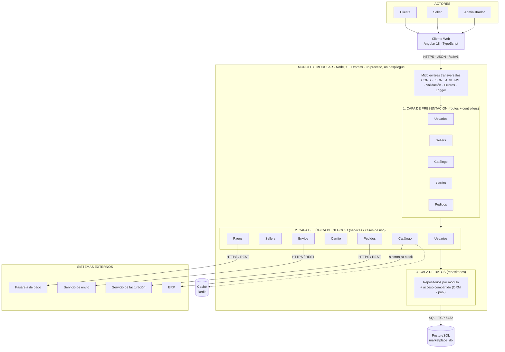

# 6. Estilo arquitectónico
 
## Estilo seleccionado
**Monolito modular + arquitectura en capas, con modelo cliente-servidor (SPA Angular + API REST).**
 
- *Monolito modular*: una sola aplicación backend (Node.js/Express), un solo proceso y un solo despliegue, dividida en módulos con límites claros.
- *Capas*: dentro de cada módulo, cada capa solo invoca a la inmediatamente inferior.
- *Cliente-servidor*: el navegador ejecuta la SPA Angular y consume la API REST.
- Capa = organización lógica; monolito = unidad de despliegue.

## Justificación
| Driver | Cómo lo atiende el estilo |
|--------|---------------------------|
| DA01 Escalabilidad | Backend *stateless*: se replican instancias detrás de un balanceador |
| DA02 Rendimiento | Llamadas en proceso (sin red entre módulos) + caché |
| DA03 Seguridad | Punto único de entrada: middleware JWT y roles |
| DA05 API REST | Frontend desacoplado vía contrato REST |
| DA06 Mantenibilidad | Módulos con límites claros; se comunican solo por su servicio |
| RC12 Alcance/plazo | Menor complejidad operativa que microservicios |
 
**Estilos descartados:** microservicios (costo operativo y consistencia distribuida innecesarios para el tamaño actual), SOA/ESB, event-driven y serverless (complejidad y curva de aprendizaje sin necesidad actual). Evolución futura: extraer Catálogo o Pedidos como servicios si la carga lo exige.
 
## Diagrama de arquitectura
 

 
## Reglas de la arquitectura
1. Cada capa solo invoca a la capa inmediatamente inferior.
2. Un módulo no accede al repositorio ni a las tablas de otro módulo; se comunica con su *service*.
3. Toda integración externa se realiza desde la capa de negocio mediante un adaptador (ver Clean Architecture).
4. Todo se ejecuta en un único proceso Node.js con una única BD.
